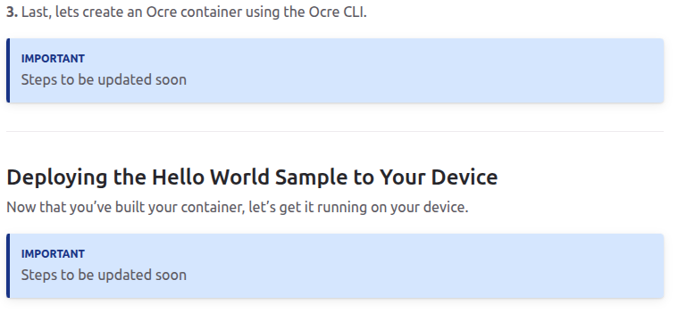
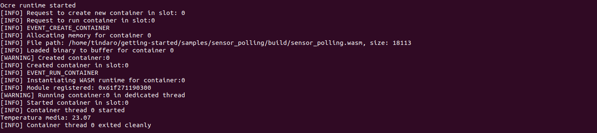

# IoT OCRE Renode su LiteX VexRiscv

Questo progetto è una simulazione IoT in cui utilizzo **Renode** per emulare una board RISC-V (`litex_vexriscv`) ed eseguire il runtime **OCRE** su **Zephyr** (attenzione, Ocre è pensato per Zephyr 3.7.0) .  
L’obiettivo è ricevere moduli **.wasm** da un server tramite **TCP/UDP**, verificarne l’integrità (es. HMAC/SHA-256) ed eseguirli con OCRE.

---

## Preparazione dell’ambiente

Per poter avviare l’ambiente completo servono i seguenti tools:

- **Renode**  
  → Guida ufficiale: [Renode docs](https://renode.readthedocs.io)

- **Zephyr RTOS**  
  → Guida: [Zephyr getting started](https://docs.zephyrproject.org/3.7.0/getting_started/index.html)

- **Zephyr SDK**  
  → [Guida installazione Zephyr SDK](https://docs.zephyrproject.org/3.7.0/develop/getting_started/index.html)

- **OCRE Runtime**  
  → [Guida ufficiale OCRE](https://docs.project-ocre.org/overview/)  
  → [Repository GitHub ufficiale OCRE](https://github.com/project-ocre/ocre-runtime)

---

## Scelta della board

Per questo progetto ho scelto la LiteX VexRiscv, una board RISC-V supportata sia da Zephyr che da Renode.

- Supporto Renode:  (presente in `platforms/boards/litex_vexriscv.repl`)
- Supporto Zephyr:  (`west build -b litex_vexriscv`)
- Supporto OCRE:  *non ancora disponibile*

Attualmente, OCRE supporta solo due board ufficiali (come indicato nel sito e nel repository ufficiale):

- `native_sim`, usata solo per test
- `B-U585I-IOT02A`, discovery kit prodotto da STMicroelectronics (non supportata da Renode)

Tuttavia, OCRE fornisce una guida per aggiungere il supporto a nuove board:  
→ [Guida OCRE board support](https://docs.project-ocre.org/board-support/)

---

## Connessione tra host e board emulata (Renode)

L’obiettivo è permettere al server locale (host) di comunicare con la board emulata in Renode, per inviare moduli WebAssembly.  
Renode consente di simulare connessioni Ethernet tramite switch virtuali e interfacce TAP.  
→ [Guida Renode Networking](https://renode.readthedocs.io/en/latest/networking/wired.html)

### Configurazione TAP su host Linux

Creazione interfaccia TAP:
```bash
sudo ip tuntap add dev tap0 mode tap user $USER
sudo ip link set tap0 up
sudo ip addr add 192.168.100.1/24 dev tap0
```

Verifica stato:
```bash
ip addr show tap0
```

### Configurazione in Renode (.repl)

Nel file `.resc` personalizzato ho definito:

- Creazione di uno switch virtuale
- Aggiunta dell’interfaccia TAP allo switch
- Connessione della periferica Ethernet della board allo switch

Esempio semplificato:
```renode
emulation CreateSwitch "sw0"
emulation CreateTap "tap0" "sw0"
connector Connect sysbus.eth sw0
```

### Configurazione IP statico su Zephyr (.conf)

Nel file `litex_vexriscv.conf`:
```conf
CONFIG_NET_CONFIG_SETTINGS=y
CONFIG_NET_CONFIG_MY_IPV4_ADDR="192.168.100.10"
CONFIG_NET_CONFIG_MY_IPV4_NETMASK="255.255.255.0"
CONFIG_NET_CONFIG_MY_IPV4_GW="192.168.100.1"
```

**Riepilogo indirizzi:**

- Board → `192.168.100.10/24`  
- Host  → `192.168.100.1/24`

---

## Test di comunicazione con Echo Server (Zephyr)

Per verificare la connessione ho compilato e avviato il sample `echo_server` fornito da Zephyr per la board `litex_vexriscv`.

### Lato host

- Interfaccia `tap0` visibile e funzionante
- Pacchetti ICMP/TCP inviati correttamente (verificato con `ping` e `tcpdump`)

### Lato board (Renode)

- Echo server in esecuzione
- IP statico correttamente impostato

---

### Problema riscontrato

- I pacchetti inviati dall’host **non vengono ricevuti dalla board**
- L’echo server **non risponde**, e i pacchetti risultano **persi**

---

### Conclusione

- La configurazione TAP lato host sembra corretta
- Il problema sembra lato board, probabilmente nella configurazione della periferica Ethernet (`LiteX_Ethernet`)
- Potrebbe trattarsi di:
  - Mancata inizializzazione del driver
  - Problema di compatibilità tra Zephyr e il modello Ethernet di Renode

---

## Creazione e deploy di un OCRE container su OCRE runtime

Prima di aggiungere il supporto per la mia scheda RISC-V (non ancora supportata da OCRE), ho provato ad aggiungere dei moduli **WASM** al runtime OCRE e farli eseguire su **native_sim**, poiché è già supportata da OCRE e non richiede né emulazione né una scheda fisica da flashare.

Ho seguito la guida ufficiale “Your first app” disponibile sul sito OCRE:  
[OCRE Quickstart – Your first app](https://docs.project-ocre.org/quickstart/first-app/)

Questa guida spiega come creare container OCRE utilizzando **Visual Studio Code**, **Docker** e l’estensione **Dev Containers**.  
Seguendola, ho creato con successo il modulo WebAssembly `hello_world.wasm`, che viene usato da OCRE CLI per creare un OCRE container.  

Tuttavia, la guida si interrompe proprio qui, con nessuna spiegazione su come creare un OCRE container, ne su come deployarlo su un qualsiasi dispositivo simulato o non.


Facendo alcune ricerche OCRE CLI "ufficiale" non è ancora pubblica ( è in roadmap ), oggi il flusso consigliato usa ORAS/OCI per creare e distribuire l'immagine che poi OCRE esegue sul nostro dispositivo.
Nel repository ufficiale di OCRE, viene presentato lo script build.sh, che serve per automatizzare la creazione del container OCRE a partire dal modulo applicativo ( modulo wasm ), più i metadati necessari.

In pratica questo script, prende il modulo wasm, genera il config JSON, impacchetta il tutto come immagine OCI e la registra localmente o su un registro.

Questo script permette di compilare e lanciare OCRE per **Zephyr** o **Linux** con diverse opzioni:

- -t <target> : Required. z = Zephyr, l = Linux
- -r : Run after build (optional)
- -f <file(s)> : Input file(s) to embed (optional)
- -b <board> : (Zephyr only) Target board (default: native_sim)
- -h : Show help

Inizialmente ho provato per target Linux:

```bash
./build.sh -t l -r -f /home/tindaro/getting-started/samples/sensor_polling/build/sensor_polling.wasm
```
Il file viene buildato e compilato senza nessun problema, mostrando anche l'output del modulo wasm


Successivmaente, ho provato ad eseguire il target Zephyr ( quello che interessa a noi ):

```bash
./build.sh -t l -r -f /home/tindaro/getting-started/samples/sensor_polling/build/sensor_polling.wasm
```
La build si ferma con il seguente errore: 
```bash
[13/1336] Generating include/generated/zephyr/version.h
-- Zephyr version: 4.2.0 (/home/tindaro/runtime/zephyr), build: v4.2.0-32-g8d0d392f8cc7
[14/1336] Running Python script to gen...e/application/src/messaging/messages.g
ninja: build stopped: subcommand failed.
FATAL ERROR: command exited with status 1: /usr/bin/cmake --build /home/tindaro/runtime/build
```

Ho risolto l'errore andando a modificare il file /runtime/application/CMakeLists. Durante la build del runtime OCRE, il file application/CMakeLists.txt utilizza xxd per convertire il modulo WASM in un array C (ocre_input_file.g), che viene poi incluso nel firmware Zephyr.
La versione originale del comando era:
```bash
COMMAND xxd -n wasm_binary -i ${OCRE_INPUT_FILE} > ${CMAKE_CURRENT_LIST_DIR}/src/ocre/ocre_input_file.g
```
Questo comando provocava l'errore durante la building, poichè xxd non riusciva a riconoscere la flag -n.

Per risolvere basta sostiuire questo comando con il nuovo comando:
```bash
COMMAND xxd -i ${OCRE_INPUT_FILE} | sed 's/unsigned char .*\\[/static const unsigned char wasm_binary[/' | sed 's/unsigned int .*_len/static const unsigned int wasm_binary_len/' > ${CMAKE_CURRENT_LIST_DIR}/src/ocre/ocre_input_file.g
```


---

### Consigli
- passare il modulo wasm tramite percorso assoluto nel comando di build.sh 
- se l'installazione di OCRE e delle librerie per farlo funzionare sono state fatte tramite venv python, ricordatevi di attivarlo prima dell'esecuzione del comando ./build.sh ...
